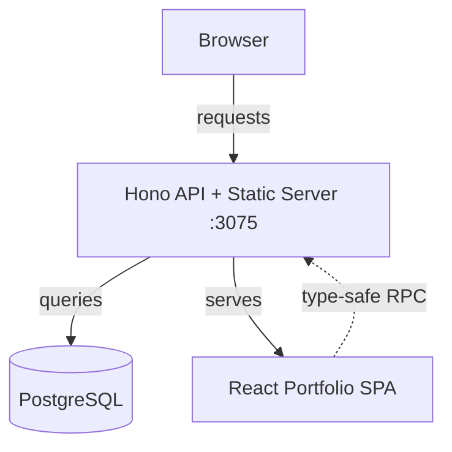
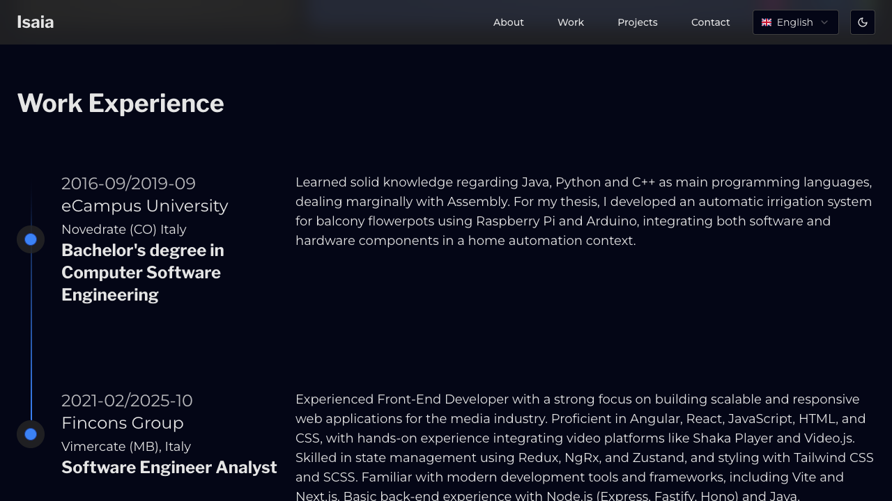
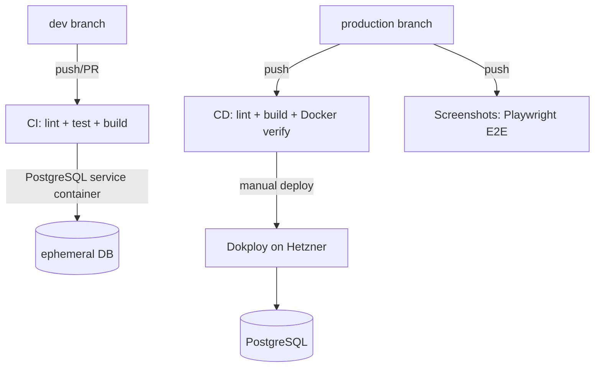

# MonorepoOnFire


> Type-safe fullstack monorepo — Hono API + React SPA + PostgreSQL, orchestrated by Turborepo

<div align="center">

[](#tech-stack)
[](#tech-stack)
[](#tech-stack)
[](#tech-stack)
[](#tech-stack)
[](#tech-stack)
[](#tech-stack)
[](https://github.com/IsaiaScope/monorepoonfire/actions)

</div>

---

## What is this?

A production-ready monorepo that powers a personal portfolio website. The **Hono backend** serves a REST API with auto-generated OpenAPI docs and delivers the **React SPA** as static files — all in a single Docker container backed by **PostgreSQL**.



The frontend imports the backend's `Routes` type directly — a schema change in a Drizzle table surfaces as a TypeScript error in the React component at compile time. No runtime surprises.

---

## Screenshots

> Auto-generated by [Playwright E2E tests](./.github/workflows/screenshots.yaml) on every push to `production`. See the [full gallery](./doc/screenshots.md) for all viewports.

| Hero | About | Work |
|------|-------|------|
|  |  |  |

| Projects | Contact | Navbar |
|----------|---------|--------|
|  |  |  |

---

## Project Structure

```
monorepoonfire/
├── app/
│   ├── hono/              # Backend API (Hono + Drizzle + PostgreSQL)
│   └── portfolio/         # Frontend SPA (React + Vite + Tailwind)
├── package/
│   ├── config/            # Shared ESLint & TypeScript configs
│   ├── shadcn/            # Radix UI primitives with Tailwind
│   ├── ui/                # App-level UI components (UI* prefix)
│   └── utility/           # Providers, types, helpers
├── doc/                   # Documentation guides
├── e2e/                   # Playwright E2E tests + screenshot capture
└── scripts/               # Build & deployment scripts
```

---

## Tech Stack

### Backend — `@app/hono`

| Layer | Technology |
|-------|-----------|
| Framework | [Hono](https://hono.dev) with OpenAPI via `@hono/zod-openapi` |
| Database | PostgreSQL 17 + [Drizzle ORM](https://orm.drizzle.team) |
| Validation | Zod schemas (shared between API spec and DB) |
| Docs | Auto-generated at `/scalar` (interactive) and `/doc` (JSON) |
| Middleware | compress, CORS, pino logger, secure-headers, timing |

```typescript
// Type-safe route → handler → database flow
const _routes = app
  .route("/", curriculum)     // /api/curriculum
  .route("/", skills)         // /api/skills
  .route("/", workExperience) // /api/work-experience
  .route("/", projects);      // /api/projects

export type Routes = typeof _routes; // Frontend imports this
```

### Frontend — `@app/portfolio`

| Layer | Technology |
|-------|-----------|
| UI | React 19 + [Tailwind CSS](https://tailwindcss.com) 4.0 + [shadcn/ui](https://ui.shadcn.com) |
| Routing | [TanStack Router](https://tanstack.com/router) (file-based, lazy) |
| Data | [TanStack Query](https://tanstack.com/query) + Hono RPC client |
| i18n | i18next (en-GB, it-IT) |
| 3D | Three.js + React Three Fiber (hero alien model) |
| Forms | React Hook Form + Zod |

```typescript
// Frontend consumes backend types — full autocomplete, zero codegen
import type { Routes } from "@app/hono/rpc";
const client = hc<Routes>(baseURL);

const res = await client.api.skills.$get();
const skills = await res.json(); // fully typed
```

### Infrastructure

| Concern | Tool |
|---------|------|
| Monorepo | Turborepo (cached builds, task orchestration) |
| Package manager | pnpm 9 (workspaces) |
| Testing | Vitest (unit/integration) + Playwright (E2E + screenshots) |
| CI/CD | GitHub Actions → Dokploy (self-hosted on Hetzner) |
| Container | Docker multi-stage build (single image, non-root) |
| Code quality | ESLint (@antfu/eslint-config) + Husky + commitlint |

---

## Quick Start

### Prerequisites

- **Node.js** >= 22
- **pnpm** >= 9.1.1
- **Docker** (for PostgreSQL)

### Setup

```bash
# Clone and install
git clone https://github.com/IsaiaScope/monorepoonfire.git
cd monorepoonfire
pnpm install

# Start PostgreSQL + run migrations + launch dev servers
pnpm dev:full
```

This starts the database container, applies migrations, and launches both the Hono API and Vite dev server with hot reload.

### Individual commands

```bash
# Development
pnpm dev                          # All apps in dev mode
pnpm --filter @app/hono dev       # Backend only
pnpm --filter @app/portfolio dev  # Frontend only

# Testing
pnpm test                         # All unit/integration tests
pnpm e2e                          # Playwright E2E (builds first)
pnpm e2e:ui                       # Playwright with interactive UI

# Building
pnpm build                        # Development build
pnpm build:production             # Production build

# Docker
pnpm docker:up                    # Build image + start container
pnpm docker:down                  # Stop + remove container
pnpm docker:logs                  # Follow logs
```

---

## Documentation

Detailed guides live in [`doc/`](./doc/):

| Guide | What it covers |
|-------|---------------|
| [Architecture Overview](./doc/architecture-overview.md) | System design, data flow, type-safe RPC, Docker stages |
| [Backend Guide](./doc/backend-guide.md) | Route modules, middleware stack, API endpoints, DB schema |
| [Frontend Guide](./doc/frontend-guide.md) | Feature architecture, providers, data fetching, testing |
| [Shared Packages](./doc/shared-packages-guide.md) | `@package/ui`, `@package/shadcn`, `@package/utility`, `@package/config` |
| [Docker Deployment](./doc/docker-deployment-guide.md) | Multi-stage build, env variables, compose config |
| [Development Workflows](./doc/development-workflows-guide.md) | Step-by-step: add routes, features, DB tables, components |
| [Environment System](./doc/environment-system-guide.md) | `@t3-oss/env-core` validation, env file resolution, CI secrets |
| [Screenshot Gallery](./doc/screenshots.md) | All Playwright-captured screenshots across 3 viewports |

---

## CI/CD



| Branch | Workflow | What runs |
|--------|----------|-----------|
| `dev` | [ci.yaml](./.github/workflows/ci.yaml) | Lint, test (with PostgreSQL service), build |
| `production` | [cd.yaml](./.github/workflows/cd.yaml) | Lint, build, Docker build verification |
| `production` | [screenshots.yaml](./.github/workflows/screenshots.yaml) | E2E tests, commit updated screenshots |

---

Made with care by [IsaiaScope](https://github.com/IsaiaScope)
