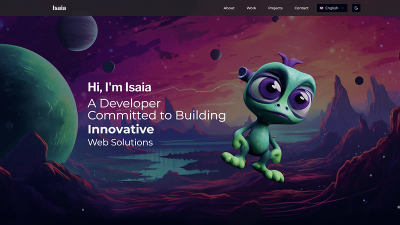
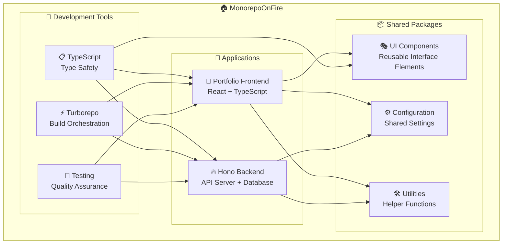

# 🔥 MonorepoOnFire



> A modern, type-safe Turbo monorepo featuring Hono backend, React frontend, and comprehensive tooling

<div align="center">

[](https://reactjs.org/)
[](https://hono.dev/)
[](https://github.com/IsaiaScope/monorepoonfire/actions)

</div>

## 🎯 Overview

MonorepoOnFire is a cutting-edge monorepo template that combines the best of modern web development. Built with performance, developer experience, and type safety in mind, it provides a solid foundation for building scalable full-stack applications.

### 🚀 Key Features

- **⚡ Lightning Fast**: Powered by Vite, Hono, and Turborepo
- **🏷️ Type Safe**: Full TypeScript coverage across the entire stack
- **🎨 Beautiful UI**: shadcn/ui components with Tailwind CSS
- **🌍 Internationalized**: i18next integration with automated translation management
- **🧪 Well Tested**: Comprehensive testing with Vitest
- **📱 Responsive**: Mobile-first design with dark mode support
- **🔒 Secure**: Built-in security best practices and validation
- **🚀 CI/CD Ready**: GitHub Actions for automated testing and deployment

## 📁 Project Structure

```
monorepoonfire/
├── 📱 app/
│   ├── 🔥 hono/              # Backend API (Hono + Drizzle)
│   └── 🎨 portfolio/         # Frontend App (React + Vite)
├── 📦 package/
│   ├── ⚙️ config/            # Shared configurations
│   ├── 🎭 shadcn/            # UI component library
│   ├── 🎨 ui/                # Custom UI components
│   └── 🛠️ utility/           # Shared utilities
├── 📄 doc/                   # Comprehensive documentation
├── 📜 script/                # Build and deployment scripts
└── ⚙️ Configuration files
```

## 🛠️ Tech Stack

### 🔥 Backend (Hono App)

- **Framework**: Hono.js
- **Database**: SQLite with Drizzle ORM
- **Runtime**: Node.js with TypeScript
- **Testing**: Vitest for unit and integration tests
- **Validation**: Zod for schema validation

### 🎨 Frontend (Portfolio App)

- **Framework**: React
- **Build Tool**: Vite for lightning-fast development
- **Styling**: Tailwind CSS with shadcn/ui components
- **State Management**: Tanstack Query for server state
- **Routing**: Tanstack Router
- **Forms**: React Hook Form
- **Internationalization**: i18next with automated translations
- **Testing**: Vitest with React Testing Library

### ⚙️ Shared Infrastructure

- **Monorepo**: Turborepo for optimized builds and caching
- **Package Manager**: pnpm for efficient dependency management
- **Type Safety**: TypeScript
- **Linting**: ESLint
- **Git Hooks**: Husky with lint-staged for quality gates
- **CI/CD**: GitHub Actions for automated workflows

## 📊 System Architecture Overview



---

## 🚀 Quick Start

### Prerequisites

- **Node.js** ≥ 22
- **pnpm** ≥ 9.1.1

### Installation

```bash
# Clone the repository
git clone https://github.com/IsaiaScope/monorepoonfire.git
cd monorepoonfire

# Install dependencies
pnpm install
```

### Development

```bash
# Start all applications in development mode
pnpm dev

# Or start specific applications
pnpm --filter @app/hono dev      # Backend only
pnpm --filter @app/portfolio dev # Frontend only
```

### Building

```bash
# Build all applications
pnpm build

# Build for specific environment
pnpm build:test
pnpm build:production
```

### Testing

```bash
# Run all tests
pnpm test

# Run tests in watch mode
pnpm test:watch
```

### Docker

```bash
# Build and start the container (production image)
pnpm docker:up

# Stop and remove container + image
pnpm docker:down

# Follow container logs
pnpm docker:logs
```

Both apps are containerized into a single image — the Hono backend serves the portfolio SPA as static files. See the [Docker Deployment Guide](./doc/docker-deployment-guide.md) for details.

## 📚 Documentation

Comprehensive documentation is available in the [`doc/`](./doc/) directory:

- **[Architecture Overview](./doc/architecture-overview.md)** - High-level system design and component relationships
- **[Frontend Guide](./doc/frontend-guide.md)** - React portfolio application development
- **[Backend Guide](./doc/backend-guide.md)** - Hono API server and database management
- **[Shared Packages Guide](./doc/shared-packages-guide.md)** - Reusable components and utilities
- **[Docker Deployment Guide](./doc/docker-deployment-guide.md)** - Containerization and Docker workflows
- **[Development Workflows Guide](./doc/development-workflows-guide.md)** - Step-by-step guides for common tasks
- **[Environment System Guide](./doc/environment-system-guide.md)** - Environment variable management

## 📞 Support

- 🐛 Issues: [GitHub Issues](https://github.com/IsaiaScope/monorepoonfire/issues)
- 📖 Docs: [Documentation](./doc/)

## 🤝 Contributing

 Made with ❤️ by <a href="https://github.com/IsaiaScope">IsaiaScope</a>
