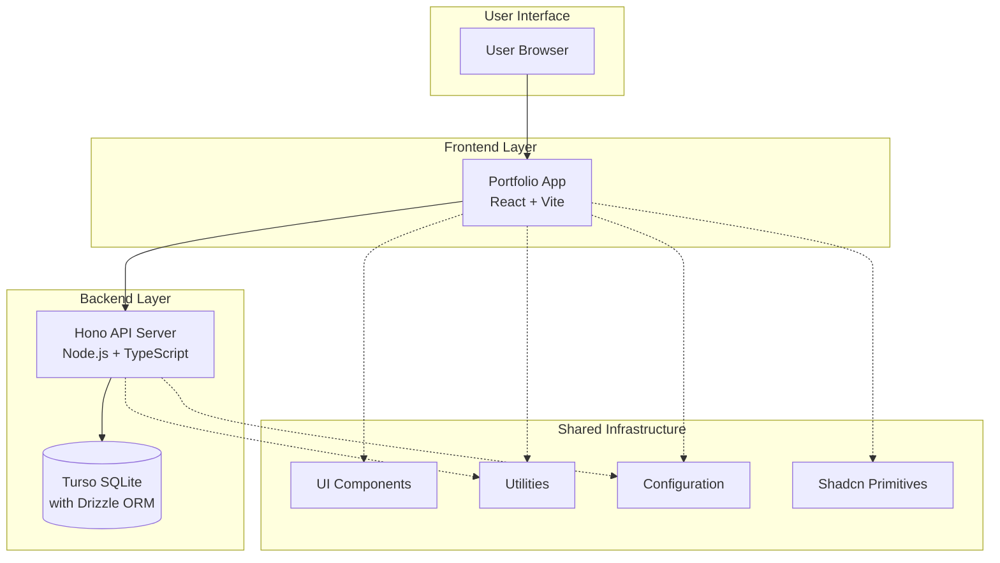
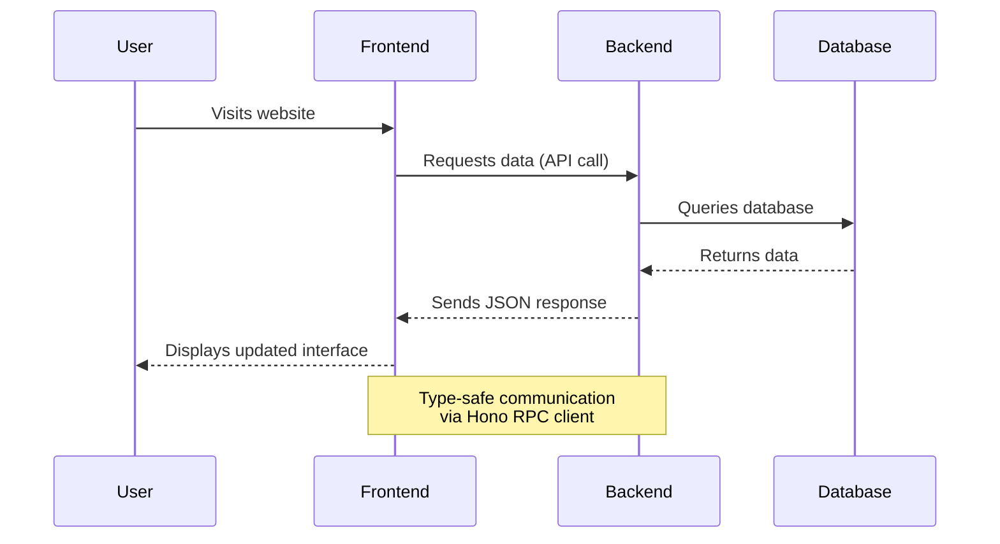
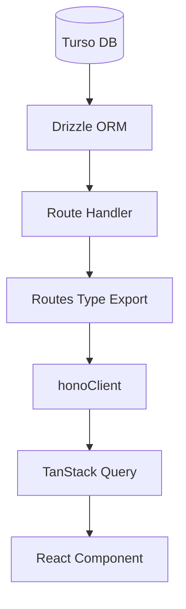
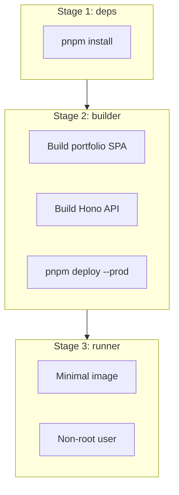

# Architecture Overview

## What is MonorepoOnFire?

MonorepoOnFire is a modern web application that combines a **React frontend** (portfolio website) with a **Hono backend** (API server) in a single codebase. Think of it like a well-organized house where different rooms (applications) share common utilities like electricity and plumbing (shared packages), but each room has its specific purpose.

The project follows a **monorepo architecture**, meaning multiple related applications live together in one repository, sharing code and tools while maintaining clear boundaries.

## System Architecture



## Core Components Explained

### Portfolio Frontend (`app/portfolio/`)

The user-facing website built with React. It's like the storefront of a shop — what visitors see and interact with.

**Key Features:**

- Responsive design that works on phones, tablets, and computers
- Dark/light mode switching
- Multiple language support (English and Italian)
- Smooth animations and modern UI components

```typescript
// Provider stack (outer to inner) in main.tsx
StrictMode > ErrorBoundary > DarkModeProvider > Suspense > TanstackQueryProvider > TanstackRouterProvider
```

### Hono Backend (`app/hono/`)

The server that handles data and business logic. Think of it as the engine room that powers everything behind the scenes.

**Key Features:**

- RESTful API with automatic OpenAPI documentation at `/scalar`
- Four data entities: curriculum, skills, work-experience, projects
- Database operations with full type safety via Drizzle ORM
- Static file serving (serves the built frontend to users)
- Fast performance with minimal overhead

```typescript
// Route assembly in app.ts
const _routes = app
  .route("/", curriculum)     // /api/curriculum
  .route("/", skills)         // /api/skills
  .route("/", workExperience) // /api/work-experience
  .route("/", projects);      // /api/projects

export type Routes = typeof _routes; // Consumed by frontend RPC client
```

### Shared Packages (`package/`)

Common code that both frontend and backend can use, like shared tools in a workshop.

| Package | Purpose |
|---------|---------|
| `@package/shadcn` | Low-level Radix UI primitives with Tailwind CSS |
| `@package/ui` | Higher-level app components (all prefixed `UI*`) |
| `@package/utility` | Providers, types, helpers (subpath exports) |
| `@package/config` | Shared ESLint and TypeScript configurations |

## Data Flow



## Type-Safe Data Flow

One of the monorepo's key strengths is end-to-end type safety. A schema change in the backend automatically surfaces type errors in the frontend at compile time:



**How it works:**

1. **Drizzle schema** (`database/schema/`) defines the table structure and generates Zod validation schemas
2. **Route handlers** are typed with `AppRouterHandler<typeof route>`, ensuring request/response match the OpenAPI spec
3. **`app.ts`** exports the `Routes` type capturing all registered routes
4. **Frontend** imports `hc<Routes>` via `@app/hono/rpc`, getting full autocomplete and type checking on API calls
5. **TanStack Query** hooks wrap the typed fetch calls, providing cached, reactive data to components

## Docker Deployment

Both applications are containerized into a single Docker image using a 3-stage build:



**Key design decisions:**

- **Stage 1** copies only `package.json` files first, so `pnpm install` is cached unless dependencies change (Docker layer caching)
- **Stage 2** builds the portfolio SPA into `app/hono/portfolio/`, then uses `pnpm deploy` to extract only production `node_modules`
- **Stage 3** runs as a non-root user (`hono`) for security, exposing only port 3075

The portfolio React SPA is served as static files by the Hono backend — there is no separate frontend container.

```bash
# Quick start with Docker
pnpm docker:up      # Build and start container
pnpm docker:down    # Stop and remove container + image
pnpm docker:logs    # Follow container logs
```

## Development Workflow

The project uses **Turborepo** to orchestrate builds and development across all applications:

1. **Development**: `pnpm dev` starts both frontend and backend simultaneously
2. **Testing**: Automated tests ensure code quality (`pnpm test`)
3. **Building**: Optimized builds for each environment (`pnpm build`, `build:test`, `build:production`)
4. **Type Safety**: TypeScript ensures code correctness across the entire stack (`pnpm check-types`)
5. **Linting**: ESLint with shared config enforces consistent style (`pnpm lint`)

## CI/CD Pipeline

| Branch | Workflow | Env | Tests | Build |
|--------|----------|-----|-------|-------|
| `dev` | ci-dev.yaml | `.env` (ephemeral SQLite) | Yes | `pnpm build` |
| `test` | ci-test.yaml | `.env.test` (Turso) | Yes | `pnpm build:test` |
| `production` | ci-production.yaml | `.env.production` (Turso) | No | No (Dokploy) |
| `production` | ci-docker.yaml | — | No | `docker build` (verify) |

## Why This Architecture?

- **Shared Code**: Common utilities and types reduce duplication
- **Type Safety**: Changes in backend automatically update frontend types
- **Developer Experience**: Single command starts entire development environment
- **Scalability**: Easy to add new applications or packages
- **Performance**: Optimized builds and caching through Turborepo
- **Maintainability**: Clear boundaries between different parts of the system
- **Production-Ready**: Docker containerization with security best practices
