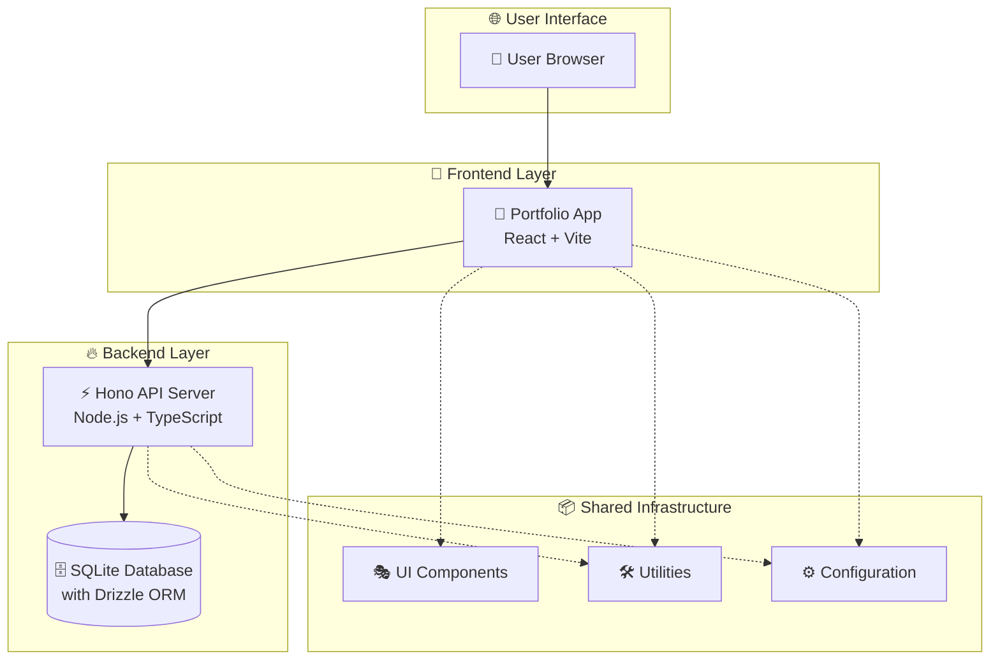
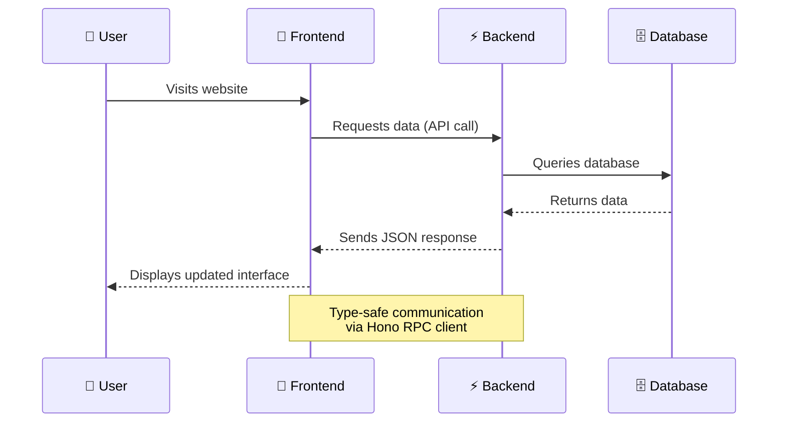

# 🏗️ Architecture Overview

## What is MonorepoOnFire?

MonorepoOnFire is a modern web application that combines a **React frontend** (portfolio website) with a **Hono backend** (API server) in a single codebase. Think of it like a well-organized house where different rooms (applications) share common utilities like electricity and plumbing (shared packages), but each room has its specific purpose.

The project follows a **monorepo architecture**, meaning multiple related applications live together in one repository, sharing code and tools while maintaining clear boundaries.

## System Architecture



## Core Components Explained

### 🎨 Portfolio Frontend (`app/portfolio/`)

The user-facing website built with React. It's like the storefront of a shop - what visitors see and interact with.

**Key Features:**

- Responsive design that works on phones, tablets, and computers
- Dark/light mode switching
- Multiple language support (internationalization)
- Smooth animations and modern UI components

```typescript
// Example: Main application entry point
const App = () => (
  <ErrorBoundary>
    <DarkModeProvider>
      <TanstackQueryProvider>
        <RouterProvider />
      </TanstackQueryProvider>
    </DarkModeProvider>
  </ErrorBoundary>
);
```

### ⚡ Hono Backend (`app/hono/`)

The server that handles data and business logic. Think of it as the engine room that powers everything behind the scenes.

**Key Features:**

- RESTful API with automatic documentation
- Database operations with type safety
- Static file serving (serves the frontend to users)
- Fast performance with minimal overhead

```typescript
// Example: API route structure
const app = initApp();

// API routes for different data types
app.route("/", skills); // /api/skills
app.route("/", workExperience); // /api/work-experience
app.route("/", projects); // /api/projects

// Serve the frontend application
app.get("*", serveStatic({ root: "./portfolio" }));
```

### 📦 Shared Packages (`package/`)

Common code that both frontend and backend can use, like shared tools in a workshop.

**Components:**

- **UI Package**: Reusable interface components (buttons, loaders, etc.)
- **Utility Package**: Helper functions and providers
- **Configuration Package**: Shared settings for TypeScript, ESLint, etc.
- **shadcn Package**: Pre-built UI component library

## Data Flow



## Development Workflow

The project uses **Turborepo** to orchestrate builds and development across all applications:

1. **Development**: `pnpm dev` starts both frontend and backend simultaneously
2. **Testing**: Automated tests ensure code quality
3. **Building**: Optimized builds for production deployment
4. **Type Safety**: TypeScript ensures code correctness across the entire stack

## Why This Architecture?

✅ **Shared Code**: Common utilities and types reduce duplication
✅ **Type Safety**: Changes in backend automatically update frontend types
✅ **Developer Experience**: Single command starts entire development environment
✅ **Scalability**: Easy to add new applications or packages
✅ **Performance**: Optimized builds and caching through Turborepo
✅ **Maintainability**: Clear boundaries between different parts of the system
