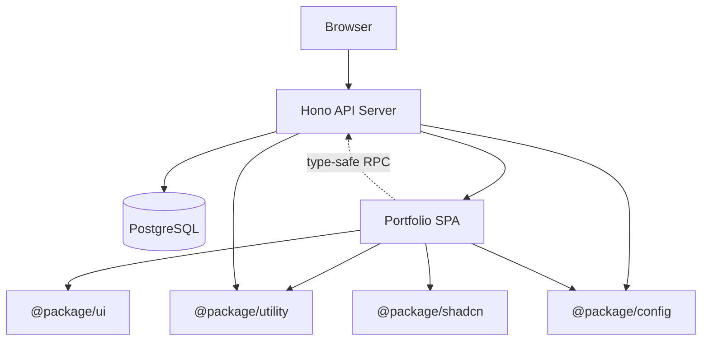
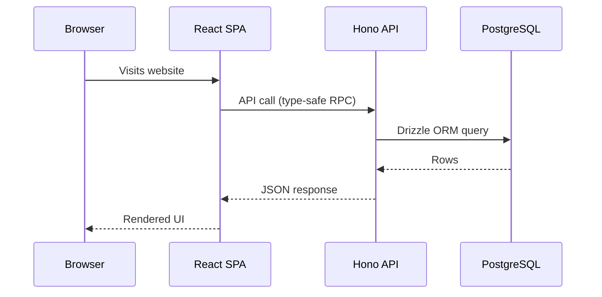
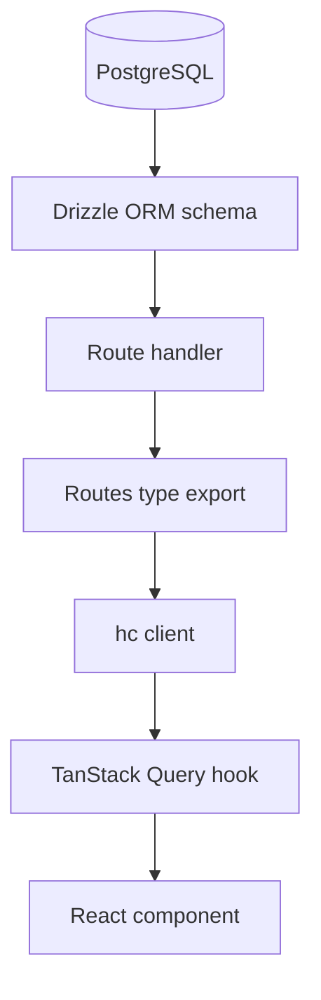
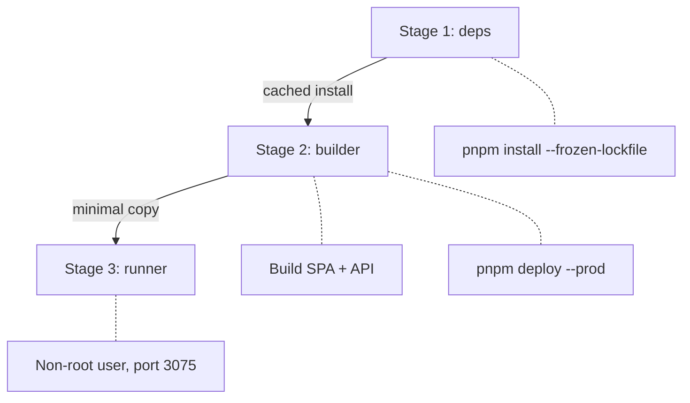
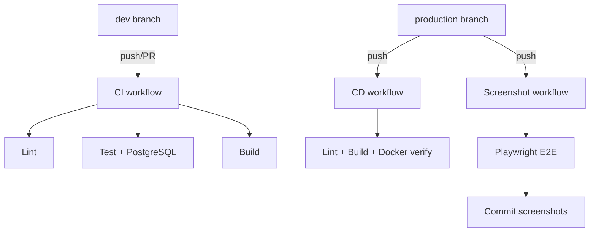

# Architecture Overview

## What is MonorepoOnFire?

A modern web application that combines a **React frontend** (portfolio website) with a **Hono backend** (API server) in a single codebase. Both apps share code and tools through a **Turborepo monorepo**, while maintaining clear boundaries between each layer.

## System Architecture



## Core Components

### Portfolio Frontend (`app/portfolio/`)

The user-facing website built with React. Responsive across phones, tablets, and desktops with dark/light mode and multi-language support (English and Italian).

|  |  |
|:---:|:---:|
| Hero section with 3D alien model | About section with skills grid |

**Provider stack** (outer to inner):

```
StrictMode > ErrorBoundary > DarkModeProvider > Suspense > TanstackQueryProvider > TanstackRouterProvider
```

### Hono Backend (`app/hono/`)

REST API with auto-generated OpenAPI documentation. Serves four data entities and delivers the built React SPA as static files.

```typescript
// Route assembly in app.ts
const _routes = app
  .route("/", curriculum)     // /api/curriculum
  .route("/", skills)         // /api/skills
  .route("/", workExperience) // /api/work-experience
  .route("/", projects);      // /api/projects

export type Routes = typeof _routes; // Consumed by frontend RPC client
```

Interactive API docs are available at `/scalar`.

### Shared Packages (`package/`)

| Package | Purpose |
|---------|---------|
| `@package/shadcn` | Radix UI primitives with Tailwind CSS |
| `@package/ui` | App-level components (all prefixed `UI*`) |
| `@package/utility` | Providers, types, helpers (subpath exports: `/provider`, `/tailwind`, `/constant`, `/@types`, `/javascript`) |
| `@package/config` | Shared ESLint and TypeScript configurations |

## Data Flow



## Type-Safe Pipeline

One of the monorepo's key strengths is end-to-end type safety. A schema change in the database automatically surfaces type errors in the frontend at compile time:



**How it works:**

1. **Drizzle schema** (`database/schema/`) defines table structure with `pgTable` and generates Zod validation schemas
2. **Route handlers** are typed with `AppRouterHandler<typeof route>`, ensuring request/response match the OpenAPI spec
3. **`app.ts`** exports the `Routes` type capturing all registered routes
4. **Frontend** imports `hc<Routes>` via `@app/hono/rpc` for full autocomplete and type checking
5. **TanStack Query** hooks wrap the typed fetch calls, providing cached reactive data to components

## Docker Deployment

Both apps are containerized into a single Docker image using a 3-stage build:



- **Stage 1** caches `pnpm install` — only re-runs when `package.json` or `pnpm-lock.yaml` changes
- **Stage 2** builds both apps, then extracts production-only `node_modules` via `pnpm deploy`
- **Stage 3** runs as non-root user `hono` (UID 1001) with only compiled JS and production dependencies

The React SPA is served as static files by the Hono backend — no separate frontend container.

```bash
pnpm docker:up      # Build and start
pnpm docker:down    # Stop and remove
pnpm docker:logs    # Follow logs
```

## Development Workflow

Turborepo orchestrates builds and development across all applications:

1. **`pnpm dev`** — starts both frontend (Vite HMR) and backend (tsx watch) simultaneously
2. **`pnpm test`** — runs Vitest across all workspaces
3. **`pnpm build`** / `build:production` — optimized builds per environment
4. **`pnpm check-types`** — TypeScript validation across the entire stack
5. **`pnpm lint`** — ESLint with shared `@antfu/eslint-config`

## CI/CD Pipeline



| Branch | Workflow | What runs |
|--------|----------|-----------|
| `dev` | ci.yaml | Lint, test (PostgreSQL service container), build |
| `production` | cd.yaml | Lint, build, Docker build verification |
| `production` | screenshots.yaml | Playwright E2E, commit updated screenshots |

Production deployment is handled manually via Dokploy (self-hosted on Hetzner) — the CD workflow only verifies the build compiles and the Docker image builds successfully.
