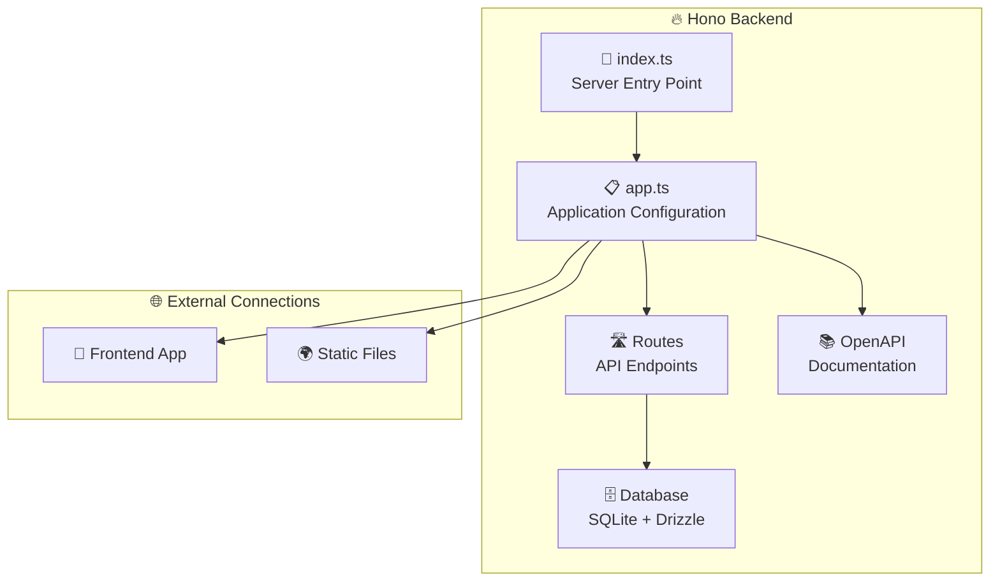
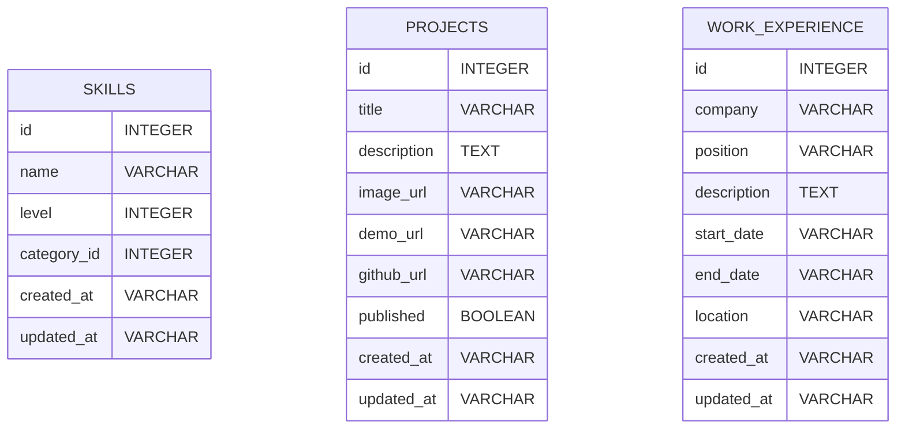

# 🔥 Backend API Guide

## Overview

The Hono backend is a high-performance API server built with TypeScript that provides data to the portfolio frontend. It features automatic API documentation, type-safe database operations, and serves the frontend application as static files.

## Architecture



## Core Features

### ⚡ High Performance API

Built with Hono.js for minimal overhead and maximum speed.

```typescript
// Application initialization with middleware
const app = initApp();

// Configure OpenAPI documentation
configureOpenApi(app);

// Register API routes
const routes = app
  .route("/", skills)
  .route("/", workExperience)
  .route("/", projects);
```

### 📚 Automatic API Documentation

Self-documenting API with OpenAPI/Swagger integration accessible at `/doc`.

### 🗄️ Type-Safe Database

SQLite database with Drizzle ORM for type-safe queries and migrations.

```typescript
// Example database query with full type safety
const projects = await db
  .select()
  .from(projectsTable)
  .where(eq(projectsTable.published, true))
  .orderBy(desc(projectsTable.createdAt));
```

### 🎯 Static File Serving

Serves the portfolio frontend application and handles SPA routing.

```typescript
// Serve static files and SPA fallback
app.get("*", serveStatic({ root: "./portfolio" }));
app.get("*", serveStatic({ path: "./portfolio/index.html" }));
```

## API Endpoints

### 📊 Skills API (`/api/skills`)

Manages technical skills and competencies.

**Endpoints:**

- `GET /api/skills` - List all skills
- `GET /api/skills/:id` - Get specific skill
- `POST /api/skills` - Create new skill
- `PUT /api/skills/:id` - Update skill
- `DELETE /api/skills/:id` - Delete skill

### 💼 Work Experience API (`/api/work-experience`)

Handles professional experience data.

**Endpoints:**

- `GET /api/work-experience` - List work experiences
- `GET /api/work-experience/:id` - Get specific experience
- `POST /api/work-experience` - Add experience
- `PUT /api/work-experience/:id` - Update experience
- `DELETE /api/work-experience/:id` - Remove experience

### 🚀 Projects API (`/api/projects`)

Manages portfolio projects and case studies.

**Endpoints:**

- `GET /api/projects` - List all projects
- `GET /api/projects/:id` - Get project details
- `POST /api/projects` - Create project
- `PUT /api/projects/:id` - Update project
- `DELETE /api/projects/:id` - Delete project

## Database Schema



## File Structure

```
src/
├── 📄 index.ts              # Server entry point
├── 📋 app.ts                # Application configuration
├── 🛣️ routes/               # API route handlers
│   ├── skills/              # Skills-related endpoints
│   ├── projects/            # Projects-related endpoints
│   └── work-experience/     # Work experience endpoints
├── 🗄️ database/             # Database configuration
│   ├── schema.ts            # Database schema definitions
│   ├── migrations/          # Database migration files
├── 📚 library/              # Utility functions
│   ├── configure-open-api.ts # API documentation setup
│   └── create-app.ts        # Application factory
├── 📋 constant/             # Application constants
├── 🌍 environment/          # Environment configuration
└── 🛠️ @types/               # TypeScript type definitions
```

## Key Technologies

### 🚀 Hono.js Framework

Ultra-fast web framework with TypeScript support and minimal overhead.

```typescript
// Route handler example
export default new Hono()
  .get("/", async (c) => {
    const skills = await getSkills();
    return c.json(skills);
  })
  .post("/", async (c) => {
    const body = await c.req.json();
    const skill = await createSkill(body);
    return c.json(skill, 201);
  });
```

### 🗄️ Drizzle ORM

Type-safe ORM with excellent TypeScript integration.

```typescript
// Schema definition
export const skillsTable = sqliteTable("skills", {
  id: integer("id").primaryKey(),
  name: text("name").notNull(),
  level: integer("level").notNull(),
  createdAt: integer("created_at", { mode: "timestamp" })
    .default(sql`CURRENT_TIMESTAMP`),
});

// Query execution
const skills = await db.select().from(skillsTable);
```

### 📚 OpenAPI Integration

Automatic API documentation generation with type validation.

```typescript
// OpenAPI route definition
.openapi({
  method: 'get',
  path: '/api/skills',
  description: 'Get all skills',
  responses: {
    200: {
      description: 'List of skills',
      content: {
        'application/json': {
          schema: skillsSchema
        }
      }
    }
  }
}, (c) => {
  // Handler implementation
});
```

## Security Features

- Input validation with Zod schemas
- CORS configuration
- Helmet.js security headers
- Environment variable validation
- SQL injection prevention with Drizzle ORM
