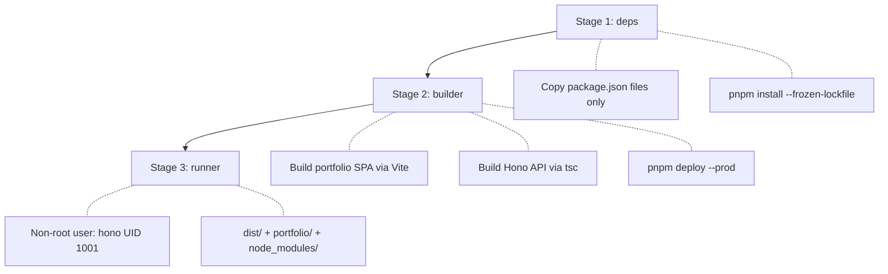

# Docker Deployment Guide

## Quick Start

```bash
pnpm docker:up      # Build image + start container (detached)
pnpm docker:logs    # Follow container logs
pnpm docker:down    # Stop container + remove local image
```

The container runs at `http://localhost:3076` (mapped from internal port 3075). Override with:

```bash
DOCKER_HOST_PORT=4000 pnpm docker:up
```

## Build Stages

The Dockerfile uses a 3-stage multi-stage build for minimal production images:



**Why 3 stages?**

- **Stage 1 (deps)**: Caches `pnpm install` — only re-runs when `package.json` or `pnpm-lock.yaml` changes
- **Stage 2 (builder)**: Builds both apps and uses `pnpm deploy` to extract only production `node_modules` (no devDependencies)
- **Stage 3 (runner)**: Minimal image with only compiled JS, static assets, and production dependencies. Runs as non-root user `hono` (UID 1001)

## docker-compose.yaml

```yaml
services:
  db:
    image: postgres:16-alpine
    environment:
      POSTGRES_USER: mof
      POSTGRES_PASSWORD: mof
    healthcheck:
      test: ["CMD-SHELL", "pg_isready -U mof"]

  hono:
    build:
      context: .
      args:
        VITE_BASE_URL: "http://localhost:${DOCKER_HOST_PORT:-3076}"
    ports:
      - "${DOCKER_HOST_PORT:-3076}:3075"
    env_file:
      - ./app/hono/src/environment/.env.production
    environment:
      - NODE_ENV=production
    depends_on:
      db:
        condition: service_healthy
```

Key points:

- `VITE_BASE_URL` build arg overrides the frontend's API base URL for local Docker testing
- Port mapping: host port (default 3076) → container port 3075
- Runtime env vars come from `.env.production` via `env_file`
- The `db` service provides PostgreSQL for local Docker testing

## Environment Variables in Docker

There are two types of env vars, injected at different stages:

| Type | When | How | Example |
|------|------|-----|---------|
| **Build-time** (`VITE_*`) | Docker build | `ARG` in Dockerfile, baked into JS bundle | `VITE_BASE_URL` |
| **Runtime** (server) | Container start | `env_file` or `environment` in compose | `DATABASE_URL`, `CORS_ORIGINS` |

`VITE_*` variables are embedded into the React SPA at build time by Vite — they cannot be changed after the image is built. Server-side variables (database, CORS, etc.) are read at runtime from the container's environment.

## .dockerignore Policy

The `.dockerignore` excludes:

- `node_modules/`, `dist/`, `.turbo/` — rebuilt inside the container
- `*.md` — documentation not needed in production
- `.github/`, `.husky/`, `.vscode/` — dev tooling
- `.env*` files — **except** portfolio env files (contain only `VITE_*` client variables, no secrets)
- `docker-compose.yaml` — not needed inside the image

## CI Docker Verification

The `cd.yaml` workflow runs on the `production` branch and includes a Docker build verification step:

```bash
# Runs: docker build . (no secrets needed)
# Purpose: Catch TypeScript compilation errors before deployment
# Does NOT push the image
```

This is separate from actual deployment — it only verifies the build compiles.

## Convenience Scripts

| Script | Command | Description |
|--------|---------|-------------|
| `pnpm docker:up` | `docker compose up --build --force-recreate -d` | Build image and start container |
| `pnpm docker:down` | `docker compose down --rmi local` | Stop container and remove local image |
| `pnpm docker:logs` | `docker compose logs -f` | Follow container stdout/stderr |

## Troubleshooting

**Container starts but API returns wrong data**
Check that `.env.production` has the correct `DATABASE_URL` pointing to your PostgreSQL database.

**CORS errors from localhost**
The `VITE_BASE_URL` build arg must match the host port. If you change `DOCKER_HOST_PORT`, rebuild the image so the SPA knows the correct API URL.

**Port already in use**
Override the host port: `DOCKER_HOST_PORT=4000 pnpm docker:up`
