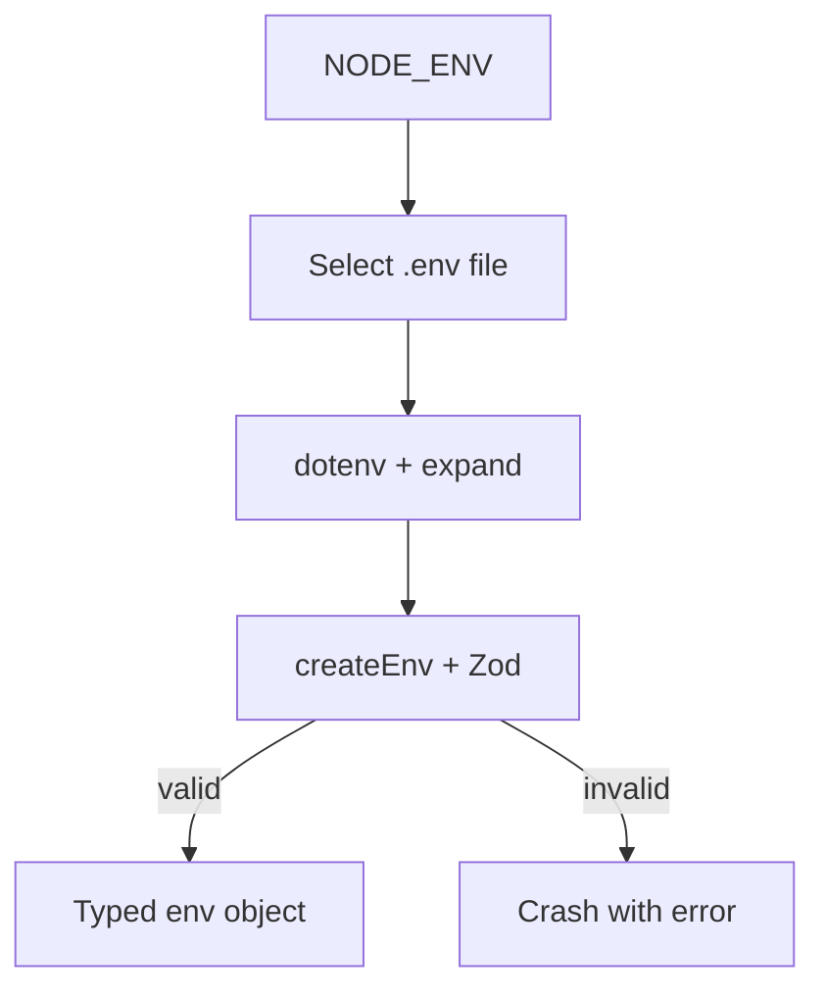
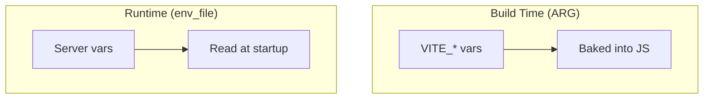

# Environment System Guide

## Overview

Both applications use `@t3-oss/env-core` with Zod schemas to validate environment variables at startup. If any variable is missing or invalid, the application crashes immediately with a detailed error — no silent failures at runtime.

The ESLint rule `node/no-process-env: error` enforces that all code accesses environment variables through the validated `env` object, never directly from `process.env` or `import.meta.env`.

## Environment Resolution Flow



### File Selection (Backend)

| `NODE_ENV` | File loaded |
|-----------|-------------|
| `development` (default) | `src/environment/.env` |
| `test` | `src/environment/.env.test` |
| `production` | `src/environment/.env.production` |

### File Selection (Frontend)

Vite handles file selection automatically based on `--mode`. The `env.ts` uses `import.meta.env` as the runtime source.

## Backend Environment Variables

**File:** `app/hono/src/environment/env.ts`

| Variable | Type | Default | Required | Description |
|----------|------|---------|----------|-------------|
| `PORT` | number | `3075` | No | Server port |
| `ENV` | enum | `development` | No | `development`, `test`, `production` |
| `LOG_LEVEL` | enum | `warn` | No | Pino log level: `trace`, `debug`, `info`, `warn`, `error`, `fatal`, `silent` |
| `DATABASE_URL` | string (url) | — | Yes | Turso/LibSQL database URL |
| `DATABASE_AUTH_TOKEN` | string | — | In test/prod | Auth token (optional in development for local `file:` databases) |
| `CORS_ORIGINS` | string | `*` | No | Comma-separated allowed origins. Use `*` for dev |
| `CANONICAL_HOST` | string | `www.isaiariva.com` | No | SEO: primary domain for host redirect |
| `RAILWAY_HOST_SNIPPET` | string | `up.railway.app` | No | SEO: Railway domain pattern to detect and redirect |

**Example `.env`:**

```env
PORT=3075
ENV=development
LOG_LEVEL=info
DATABASE_URL=file:local.db
DATABASE_AUTH_TOKEN=
CORS_ORIGINS=*
```

## Frontend Environment Variables

**File:** `app/portfolio/src/environment/env.ts`

| Variable | Type | Default | Required | Description |
|----------|------|---------|----------|-------------|
| `VITE_MODE` | enum | `development` | No | `development`, `production`, `test` |
| `VITE_SHOW_TANSTACK_DEVTOOLS` | boolean | `false` | No | Show TanStack Query/Router devtools |
| `VITE_SERVER_PORT` | string (4 chars) | — | Yes | Dev server port (must be 4-digit number) |
| `VITE_BASE_URL` | string (url) | `http://localhost:3075` | No | Backend API base URL |

All frontend variables must have the `VITE_` prefix. This is enforced by `@t3-oss/env-core`'s `clientPrefix` option and by Vite's built-in filtering.

## Environment in Docker

Docker introduces a split between **build-time** and **runtime** variables:



- `VITE_*` variables are embedded at build time — changing them requires rebuilding the image
- Server variables are injected at container start via `env_file` in `docker-compose.yaml`
- The `VITE_BASE_URL` build arg in docker-compose overrides the production default for local testing

## CI Environment Creation

CI workflows create `.env` files from GitHub secrets using `script/create-env.mjs`:

```bash
# In CI workflow:
pnpm deploy:test        # Creates .env.test from secrets
pnpm deploy:production  # Creates .env.production from secrets
```

The script reads from `process.env` (populated by GitHub Actions secrets) and writes the appropriate `.env` file. This means:

1. Add new variables to GitHub repository settings (Secrets or Variables)
2. Update `script/create-env.mjs` to include the new variable
3. Update the CI workflow YAML if the variable needs to be mapped

## Validation Pattern

Both apps use the same pattern:

```typescript
import { createEnv } from "@t3-oss/env-core";
import { z } from "zod";

export const env = createEnv({
  server: {
    PORT: z.coerce.number().int().default(3075),
    DATABASE_URL: z.string().url(),
    // ... more variables
  },
  runtimeEnv: process.env,
  emptyStringAsUndefined: true,
});
```

Key features:

- **`emptyStringAsUndefined: true`** — Empty strings (`PORT=`) are treated as missing, so defaults apply correctly
- **`z.coerce.number()`** — Automatically converts string env vars to numbers
- **Conditional validation** — `DATABASE_AUTH_TOKEN` uses `.refine()` to be required only in test/production
- **Fail-fast** — Invalid env crashes the app at import time, not when the variable is first used

## Troubleshooting

**"Environment variable X is required"**
Check the correct `.env` file exists in `src/environment/` and contains the variable. Use `.env.example` as a reference.

**"DATABASE_AUTH_TOKEN is required in test or production"**
This token is optional for `file:` databases in development but required for Turso cloud databases in test/production.

**Empty string not using default**
Ensure `emptyStringAsUndefined: true` is set in `createEnv()`. Without it, `PORT=` would be treated as an empty string instead of triggering the default.
