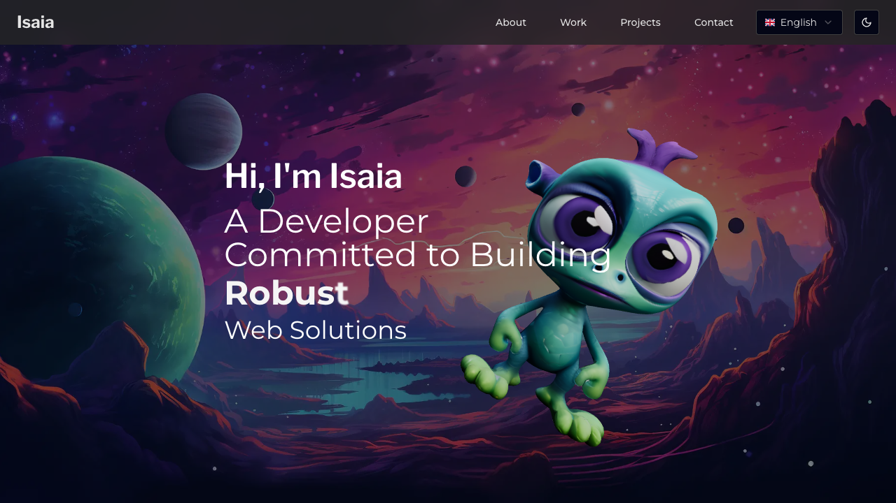
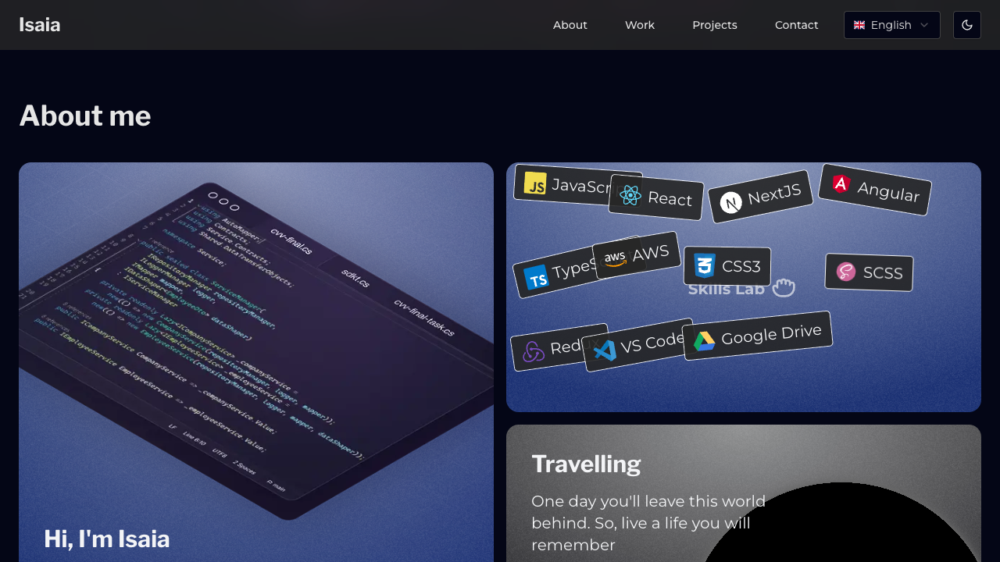
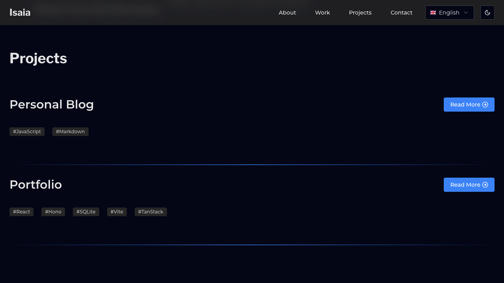
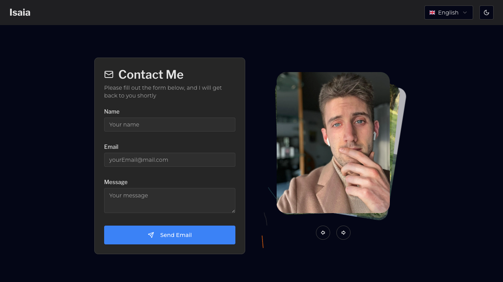
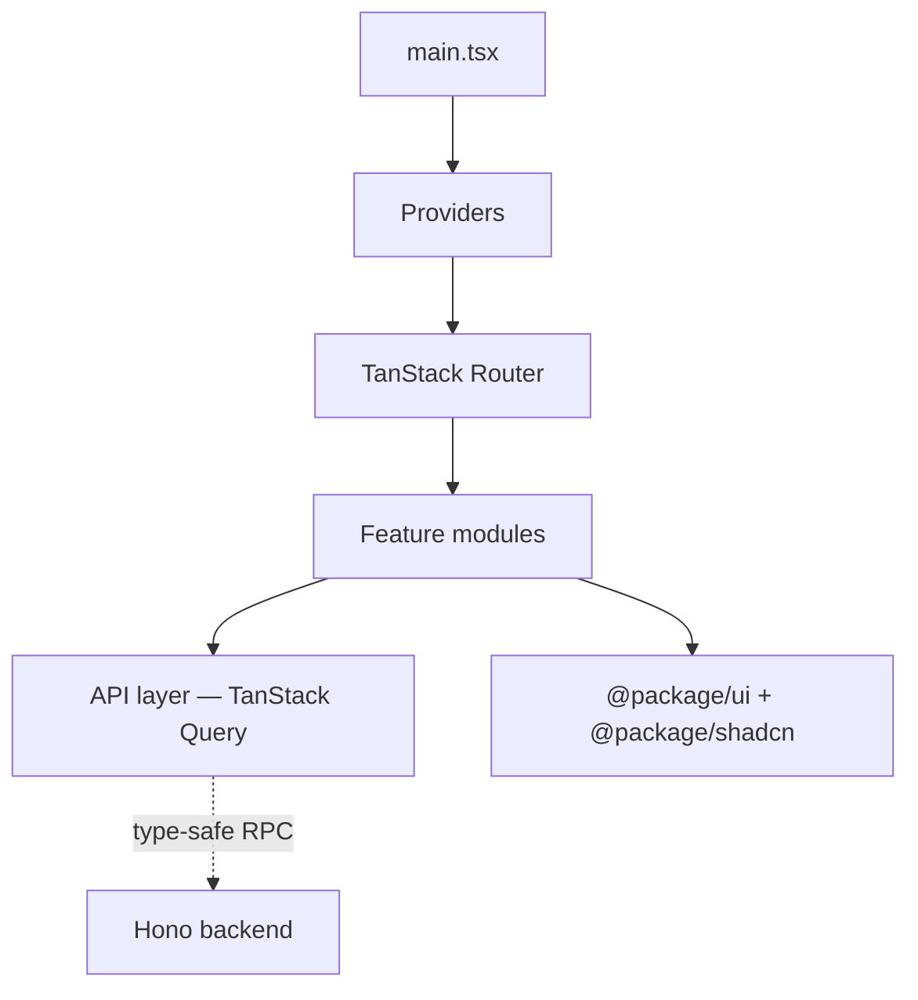
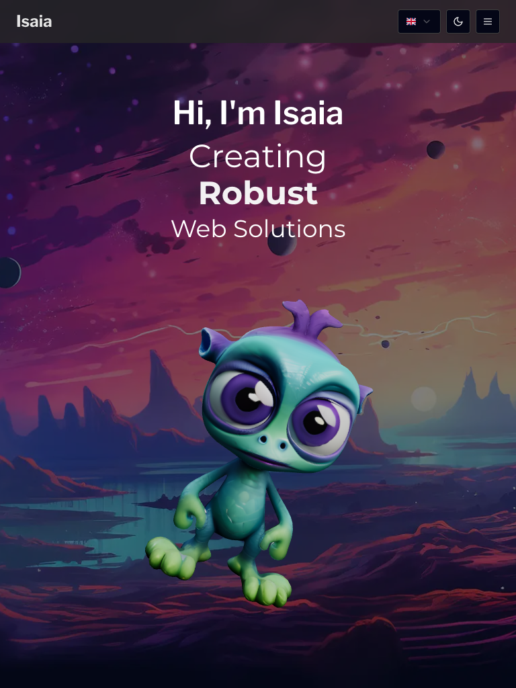
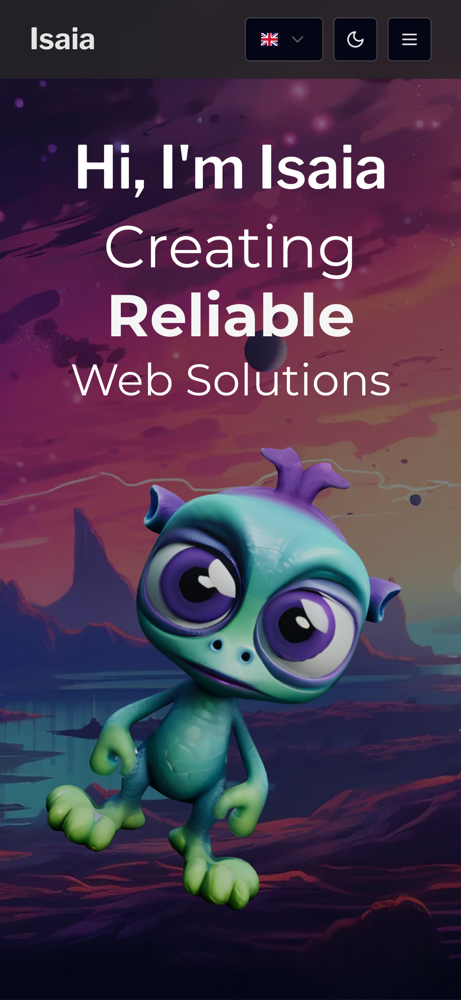

# Frontend Application Guide

## Overview

The Portfolio frontend is a React application that showcases projects, skills, and work experience. It features responsive design, dark/light mode, internationalization (English and Italian), and interactive 3D elements powered by Three.js.

|  |  |
|:---:|:---:|
| Hero — 3D alien model with spring animation | About — skills grid and orbiting frameworks |

|  |  |
|:---:|:---:|
| Projects — showcase cards | Contact — form with EmailJS |

## Application Structure



## Provider Stack

The app wraps all content in a layered provider stack (outer to inner):

```
StrictMode > ErrorBoundary > DarkModeProvider > Suspense > TanstackQueryProvider > TanstackRouterProvider
```

```typescript
// main.tsx
root.render(
  <StrictMode>
    <ErrorBoundary FallbackComponent={UIBoundaryError}>
      <DarkModeProvider defaultTheme="dark">
        <Suspense fallback={<UIFullPageDotsLoaderOnFire />}>
          <TanstackQueryProvider>
            <TanstackRouterProvider />
          </TanstackQueryProvider>
        </Suspense>
      </DarkModeProvider>
    </ErrorBoundary>
  </StrictMode>
);
```

## Features

### Dark/Light Mode

Theme switching with persistence via `DarkModeProvider` from `@package/utility`:

```typescript
const { theme, setTheme } = useDarkMode();
<UIDarkModeSwitch theme={theme} onThemeChange={setTheme} />
```

### Internationalization (i18n)

Multi-language support with i18next. Translations live in `public/locales/{lang}/common.json`.

```typescript
const { t, i18n } = useTranslation();
<h1>{t("portfolio.title")}</h1>
<UILanguageSelector
  language={i18n.language}
  onLanguageChange={(lng) => i18n.changeLanguage(lng)}
/>
```

### 3D Graphics

The hero section renders a 3D alien model using React Three Fiber with spring opacity animation:

```typescript
<Canvas>
  <ambientLight intensity={1.5} />
  <Suspense fallback={null}>
    <Float>
      <Alien scale={[2, 2, 2]} position={[1.9, -0.1, 0.3]} />
    </Float>
  </Suspense>
</Canvas>
```

The About section includes a rotating globe (cobe) and orbiting framework icons.

### Data Fetching

Two-file pattern for every API resource — a raw fetch function plus a TanStack Query hook:

```typescript
// api/skills.ts — raw fetch
export async function getSkills() {
  const res = await honoClient.api.skills.$get();
  return res.json();
}

// api/use-skills.ts — query hook
export function useSkills() {
  return useQuery({
    queryKey: QUERY_KEYS.SKILLS,
    queryFn: getSkills,
  });
}
```

### Responsive Design

Mobile-first approach with Tailwind CSS. Three viewport targets are tested with Playwright:

| Desktop (1280x720) | Tablet (768x1024) | Mobile (393x851) |
|:---:|:---:|:---:|
|  |  |  |

## File Structure

```
src/
├── main.tsx             # Entry point
├── global.css           # Global styles + Tailwind
├── font.css             # Font definitions
├── provider/            # App providers (router, query)
├── routes/              # TanStack Router file-based routes
├── component/           # Shared components (navbar, footer)
├── feature/             # Feature modules (see below)
├── api/                 # RPC client setup
├── constant/            # Query keys, app constants
├── environment/         # VITE_* env validation
├── utility/             # Helper functions
├── library/             # i18next config
├── @types/              # TypeScript definitions + i18n resources
└── test/                # Testing utilities
    ├── set-up-test.tsx  # Custom render with providers
    └── mocks/           # MSW handlers + mock data
```

## Feature Module Pattern

Each feature is self-contained:

```
src/feature/{name}/
├── {name}.tsx           # Main component
├── {name}.test.tsx      # Tests
├── api/
│   ├── {resource}.ts    # Raw API call via honoClient
│   └── use-{resource}.ts  # TanStack Query hook
├── component/           # Sub-components
└── hooks/               # Feature-specific hooks
```

Current features: `hero`, `about`, `work`, `projects`, `contact`

## State Management

| State type | Solution |
|-----------|----------|
| Server state | TanStack Query (API data with caching + background updates) |
| Client state | React hooks and context (UI toggles, form state) |
| Global state | Providers for theme, language, configuration |

## Testing

Custom render in `src/test/set-up-test.tsx` wraps components with all necessary providers:

```typescript
renderWithProviders(<WorkSection />, {
  viewport: "mobile",      // sets media query context
  location: "/",           // sets router location
  language: "en-GB",       // sets i18n language
});
```

- **MSW** mocks API responses in `src/test/mocks/handlers.ts`
- **Mock data** lives in `src/test/mocks/data/` as JSON files
- Query keys are centralized in `src/constant/` to avoid duplication

## Development

```bash
pnpm --filter @app/portfolio dev         # Vite dev server with HMR
pnpm --filter @app/portfolio test:watch  # Tests in watch mode
pnpm --filter @app/portfolio build       # Development build
pnpm --filter @app/portfolio build:production  # Production build
```

Build output goes to `app/hono/portfolio/` — the Hono backend serves it as static files.
