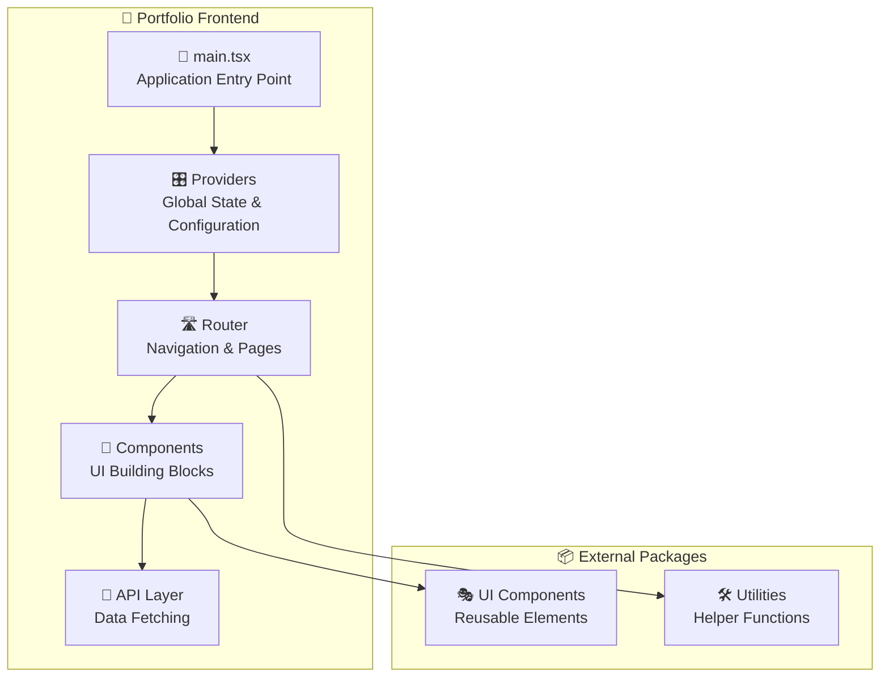

# 🎨 Frontend Application Guide

## Overview

The Portfolio frontend is a modern React application that showcases projects, skills, and work experience. Built for performance and user experience, it provides a responsive interface that works seamlessly across all devices.

## Application Structure



## Key Features

### 🌓 Dark/Light Mode

Automatic theme switching with user preference persistence.

```typescript
// Usage in components
const { theme, setTheme } = useDarkMode();

// Toggle between themes
<UIDarkModeSwitch
  theme={theme}
  onThemeChange={setTheme}
/>
```

### 🌍 Internationalization (i18n)

Multi-language support with dynamic content translation.

```typescript
// Language switching
const { t, i18n } = useTranslation();

// Display translated content
<h1>{t('portfolio.title')}</h1>

// Change language
<UILanguageSelector
  language={i18n.language}
  onLanguageChange={(lng) => i18n.changeLanguage(lng)}
/>
```

### 📱 Responsive Design

Mobile-first approach with Tailwind CSS for consistent styling across devices.

### ⚡ Performance Optimization

- Code splitting with lazy loading
- Image optimization
- Bundle size optimization with Vite
- Efficient re-rendering with React optimization patterns

## Core Technologies

### 🚀 Application Foundation

```typescript
// main.tsx - Application bootstrap
const rootElement = document.getElementById("app");
const root = ReactDOM.createRoot(rootElement);

root.render(
  <StrictMode>
    <ErrorBoundary FallbackComponent={UIBoundaryError}>
      <DarkModeProvider defaultTheme="dark">
        <Suspense fallback={<UIFullPageDotsLoaderOnFire />}>
          <TanstackQueryProvider>
            <TanstackRouterProvider />
          </TanstackQueryProvider>
        </Suspense>
      </DarkModeProvider>
    </ErrorBoundary>
  </StrictMode>
);
```

### 📡 Data Fetching with TanStack Query

Efficient server state management with caching, background updates, and offline support.

```typescript
// Example API call
const { data: projects, isLoading } = useQuery({
  queryKey: ["projects"],
  queryFn: () => api.projects.$get(),
  staleTime: 5 * 60 * 1000, // 5 minutes
});
```

### 🛣️ Routing with TanStack Router

Type-safe routing with code splitting and nested layouts.

### 🎨 UI Components

Built with **shadcn/ui** components and custom UI package components for consistency.

## Development Workflow

### 🔧 Local Development

```bash
# Start development server
pnpm --filter @app/portfolio dev

# Run tests in watch mode
pnpm --filter @app/portfolio test:watch
```

### 🧪 Testing Strategy

- **Unit Tests**: Component logic and utilities
- **Integration Tests**: User interactions and data flow
- **Visual Tests**: Component rendering and styling

### 📦 Build Process

```bash
# Development build
pnpm --filter @app/portfolio build

# Production build with optimizations
pnpm --filter @app/portfolio build:production
```

## File Structure

```
src/
├── 📄 main.tsx             # Application entry point
├── 🎨 global.css           # Global styles
├── 🛠️ reportWebVitals.ts   # Performance monitoring
├── 🎛️ provider/            # Application providers
├── 🛣️ routes/              # Page components and routing
├── 🧩 component/           # Reusable components
├── 📡 api/                 # API client and queries
├── 🎨 feature/             # Feature-specific components
├── 🔧 utility/             # Helper functions
├── 📋 constant/            # Application constants
├── 🌍 environment/         # Environment configuration
└── 🧪 test/                # Test utilities
```

## Key Concepts

### 🔄 State Management Strategy

- **Server State**: TanStack Query for API data
- **Client State**: React hooks and context for UI state
- **Global State**: Providers for theme, language, and configuration

### 🎯 Performance Best Practices

- Lazy loading for route components
- Image optimization and lazy loading
- Memoization for expensive calculations
- Efficient re-rendering patterns

### 🔒 Type Safety

Full TypeScript integration with:

- API response types from backend
- Component prop validation
- Route parameter typing
- Environment variable validation
