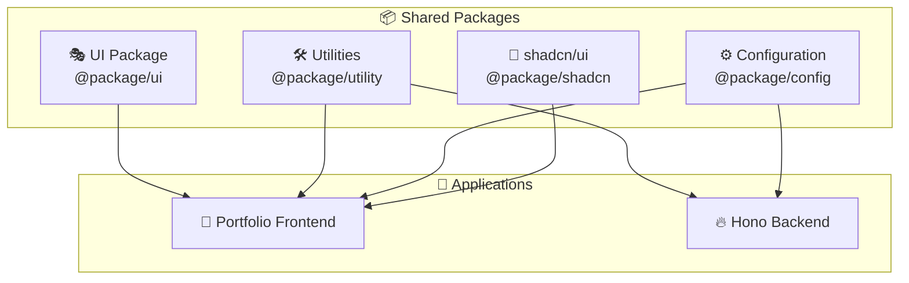

# 📦 Shared Packages Guide

## Overview

The shared packages system is the foundation that allows code reuse across the monorepo. Think of it as a shared toolbox that both the frontend and backend applications can access. This approach eliminates code duplication and ensures consistency across the entire project.

## Package Architecture



## Package Breakdown

### 🎭 UI Package (`@package/ui`)

**Purpose:** Reusable UI components that maintain design consistency across applications.

**Key Components:**

- **Dark Mode Switch**: Theme toggle functionality
- **Error Boundaries**: Graceful error handling UI
- **Image Component**: Optimized image rendering
- **Language Selector**: Internationalization UI
- **Link Component**: Enhanced navigation links
- **Loaders**: Loading state indicators
- **Wrapper Components**: Layout and container elements

```typescript
// Example usage
import {
  UIDarkModeSwitch,
  UIBoundaryError,
  UIFullPageDotsLoaderOnFire
} from '@package/ui';

// In your component
<UIDarkModeSwitch
  theme={theme}
  onThemeChange={setTheme}
/>
```

### 🛠️ Utilities Package (`@package/utility`)

**Purpose:** Common functionality and providers used across applications.

**Key Features:**

- **Providers**: React context providers for global state
- **Type Definitions**: Shared TypeScript types
- **Helper Functions**: Common utility functions
- **Constants**: Shared application constants
- **Tailwind Utilities**: CSS utility classes

```typescript
// Provider usage
import {
  DarkModeProvider,
  TanstackQueryProvider
} from '@package/utility/provider';

// Wrap your app
<DarkModeProvider defaultTheme="dark">
  <TanstackQueryProvider>
    <App />
  </TanstackQueryProvider>
</DarkModeProvider>
```

**Type System:**

```typescript
// Shared types for better type safety
export type Nullable<T> = T | null;
export type Maybe<T> = T | undefined;
export type ObjectKeys<T> = keyof T;
export type ObjectValues<T> = T[keyof T];
```

### ⚙️ Configuration Package (`@package/config`)

**Purpose:** Shared configuration files for development tools and build processes.

**Configurations Included:**

- **ESLint**: Code linting rules and standards
- **TypeScript**: Shared tsconfig files for different environments
  - `base.json`: Common TypeScript settings
  - `hono.json`: Backend-specific configuration
  - `react.json`: Frontend-specific configuration

### 🎨 shadcn/ui Package (`@package/shadcn`)

**Purpose:** Pre-built, customizable UI components based on Radix UI primitives.

**Features:**

- Accessible components by default
- Customizable with CSS variables
- Full TypeScript support
- Copy-paste friendly
- Consistent design system

```typescript
// Component examples
import { Button, Card, Dialog } from '@package/shadcn';

// Usage in your components
<Card>
  <Card.Header>
    <Card.Title>Project Title</Card.Title>
  </Card.Header>
  <Card.Content>
    <p>Project description</p>
  </Card.Content>
</Card>
```
### 🔄 Using Packages in Applications

```typescript
import { baseConfig } from "@package/config";
// Import from packages using workspace aliases
import { UIButton } from "@package/ui";
import { formatDate } from "@package/utility";
```

## File Structure

```
package/
├── 🎭 ui/                      # UI Components
│   ├── package.json
│   ├── tsconfig.json
│   └── src/
│       ├── index.ts            # Main exports
│       ├── dark-mode-switch/   # Theme switching
│       ├── error/              # Error boundaries
│       ├── image/              # Image component
│       ├── language-selector/  # i18n selector
│       ├── link/               # Enhanced links
│       ├── loader/             # Loading indicators
│       └── wrapper/            # Layout components
├── 🛠️ utility/                 # Utilities & Providers
│   ├── package.json
│   ├── tsconfig.json
│   ├── @types/                 # Type definitions
│   ├── constant/               # Shared constants
│   ├── javascript/             # JS utilities
│   ├── provider/               # React providers
│   └── tailwind/               # CSS utilities
├── ⚙️ config/                  # Configuration Files
│   ├── package.json
│   ├── eslint/                 # ESLint configurations
│   └── typescript/             # TypeScript configs
└── 🎨 shadcn/                  # UI Component Library
    ├── package.json
    ├── tsconfig.json
    └── src/
        ├── index.ts
        ├── shadcn.css          # Component styles
        └── component/          # UI components
```

## Benefits of Shared Packages

### ✅ Code Reusability

- Components written once, used everywhere
- Consistent behavior across applications
- Reduced development time

### ✅ Maintainability

- Single source of truth for common functionality
- Easy to update shared logic
- Centralized bug fixes

### ✅ Type Safety

- Shared TypeScript types ensure consistency
- Compile-time error checking across packages
- Better IDE support and autocomplete

### ✅ Development Experience

- Hot module replacement during development
- Integrated testing across packages
- Unified build and deployment process

## Best Practices

### 🎯 Package Design Principles

1. **Single Responsibility**: Each package has a clear, focused purpose
2. **Minimal Dependencies**: Keep external dependencies to a minimum
3. **Type Safety**: Full TypeScript coverage for all exports
4. **Documentation**: Clear examples and usage instructions
5. **Testing**: Comprehensive test coverage for shared functionality

This shared package system creates a robust foundation for the monorepo, enabling efficient development while maintaining code quality and consistency across all applications.
