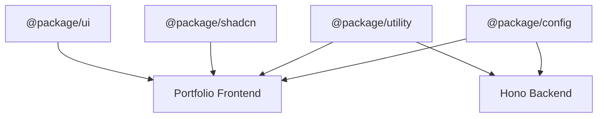

# Shared Packages Guide

## Overview

The shared packages system enables code reuse across the monorepo. Both the frontend and backend apps import from these packages instead of duplicating logic — shared types, UI components, configuration, and utilities all live here.

## Package Architecture



## Package Breakdown

### UI Package (`@package/ui`)

Higher-level app components that compose shadcn primitives. All exports are prefixed with `UI*` for easy identification.

**Components:**

| Component | Purpose |
|-----------|---------|
| `UIDarkModeSwitch` | Theme toggle |
| `UILanguageSelector` | i18n language picker |
| `UIErrorBoundary` | Error boundary wrapper |
| `UIBoundaryError` | Error fallback UI |
| `UIFullPageDotsLoaderOnFire` | Full-page loading indicator |
| `UIWrapper` | Section layout wrapper with variants |
| `UIImage` | Optimized image component |
| `UILink` | Enhanced navigation links |

```typescript
import { UIDarkModeSwitch, UIWrapper } from "@package/ui";

<UIWrapper tag="section" variant="primary">
  <UIDarkModeSwitch theme={theme} onThemeChange={setTheme} />
</UIWrapper>
```

### Utilities Package (`@package/utility`)

Common functionality shared across apps. Uses **subpath exports** for tree-shaking:

```typescript
import { DarkModeProvider, TanstackQueryProvider } from "@package/utility/provider";
import { cn } from "@package/utility/tailwind";
import { PACKAGE_UTILITY } from "@package/utility/constant";
import type { Nullable, Maybe } from "@package/utility/@types";
```

| Subpath | Contents |
|---------|----------|
| `/provider` | DarkModeProvider, TanstackQueryProvider, TanstackRouterProvider |
| `/tailwind` | `cn()` class merging utility |
| `/constant` | Media query breakpoints, shared constants |
| `/@types` | Shared type utilities (`Nullable<T>`, `Maybe<T>`, `ObjectKeys<T>`) |
| `/javascript` | General-purpose helper functions |

### Configuration Package (`@package/config`)

Shared ESLint and TypeScript configurations consumed by all workspaces.

**TypeScript configs:**

| Config | Used by |
|--------|---------|
| `typescript/base` | All packages |
| `typescript/hono` | Backend app |
| `typescript/react` | Frontend app, UI packages |
| `typescript/react-vite` | Frontend app (includes Vite types) |

**ESLint config:**

```typescript
import { createEslintConfig } from "@package/config/eslint/create-config";

export default createEslintConfig({
  // Extends @antfu/eslint-config with project rules:
  // double quotes, semicolons, 2-space indent
  // type keyword only (no interface)
  // kebab-case filenames
});
```

### shadcn Package (`@package/shadcn`)

Radix UI primitives styled with Tailwind CSS. These are the low-level building blocks that `@package/ui` composes into app-level components.

```typescript
import { Button, Card, Dialog, Select } from "@package/shadcn";

<Card>
  <CardHeader>
    <CardTitle>Project Title</CardTitle>
  </CardHeader>
  <CardContent>
    <p>Project description</p>
  </CardContent>
</Card>
```

Key dependencies: `@radix-ui/*`, `class-variance-authority`, `lucide-react`, `sonner`

## File Structure

```
package/
├── ui/                      # App-level UI components (UI* prefix)
│   ├── package.json
│   └── src/
│       ├── index.ts         # Re-exports all components
│       ├── dark-mode-switch/
│       ├── error/
│       ├── image/
│       ├── language-selector/
│       ├── link/
│       ├── loader/
│       └── wrapper/
├── utility/                 # Shared utilities & providers
│   ├── package.json
│   ├── @types/
│   ├── constant/
│   ├── javascript/
│   ├── provider/
│   └── tailwind/
├── config/                  # ESLint & TypeScript configs
│   ├── package.json
│   ├── eslint/
│   └── typescript/
└── shadcn/                  # Radix UI primitives
    ├── package.json
    └── src/
        ├── index.ts
        ├── shadcn.css
        └── component/
```

## Adding New Components

### To shadcn (low-level primitive)

1. Create `package/shadcn/src/component/{name}.tsx`
2. Follow Radix UI + CVA pattern, use `cn()` from `@package/utility/tailwind`
3. Export from `package/shadcn/src/index.ts`

### To ui (app-level composition)

1. Create `package/ui/src/{component-name}/{component-name}.tsx` — prefix with `UI`
2. Create `package/ui/src/{component-name}/{component-name}.test.tsx`
3. Export from `package/ui/src/index.ts`
